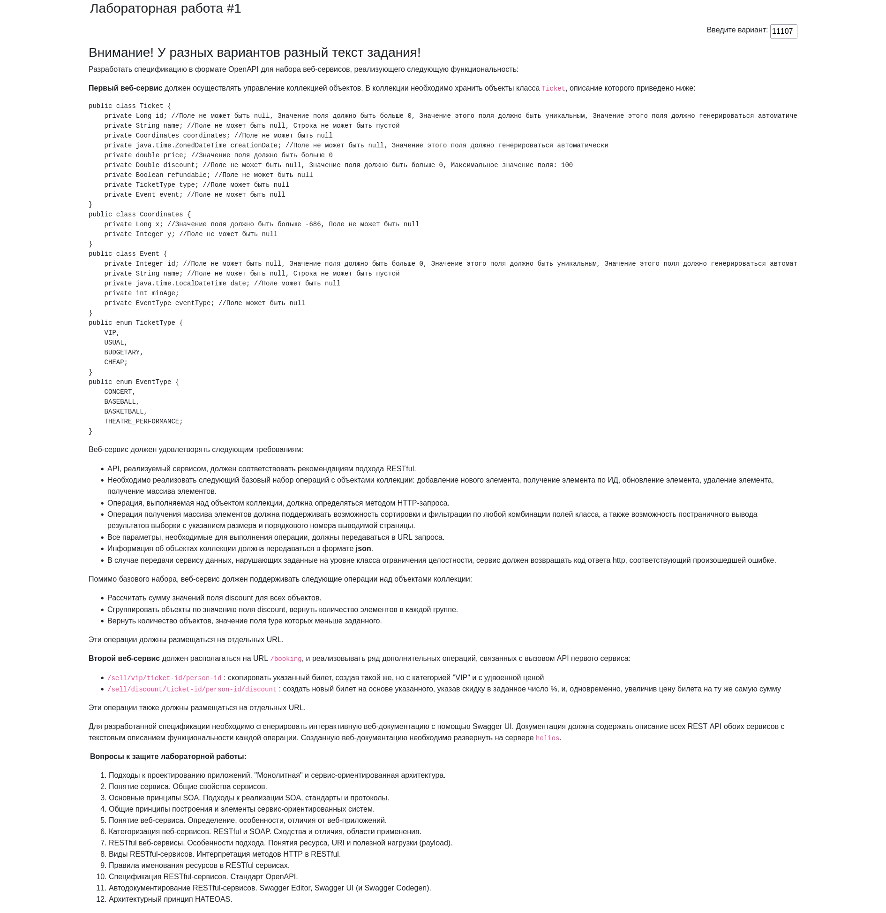
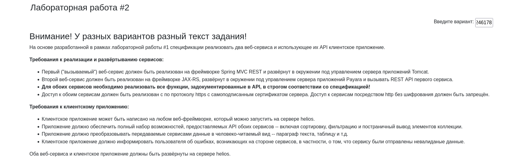
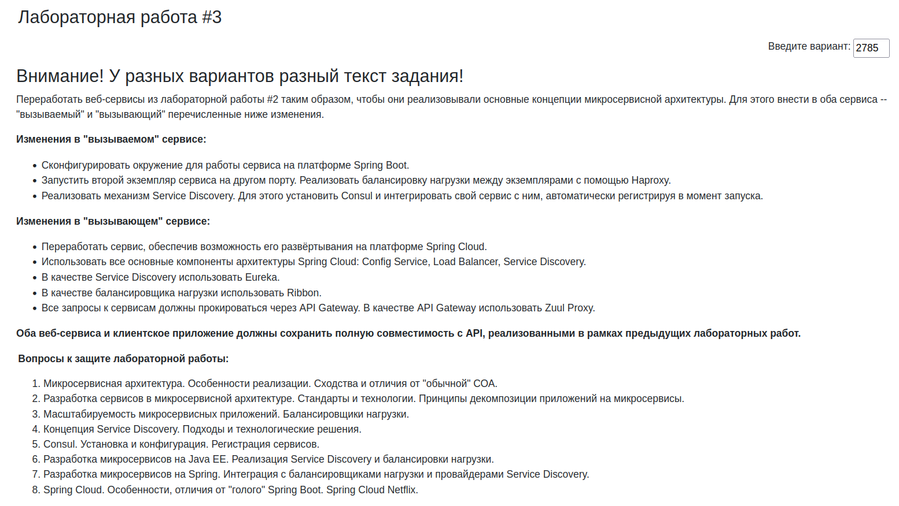
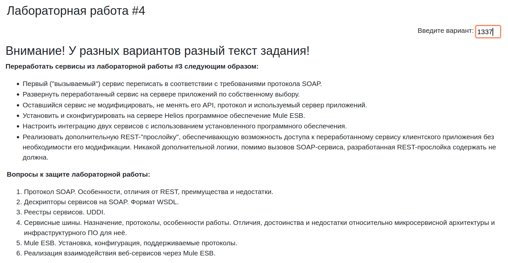

# Lab 2

Consul stats: http://localhost:8500/ui/
Haproxy stats: http://localhost:18888/stats
Haproxy vip: https://localhost:18800/tickets

Eureka: http://localhost:8761/






### BUILD UI

```sh
cd front
npm install
npm run release
````
copy everything from ./front/resources/public into helios
(or open ./front/resources/public/index.html)

https://se.ifmo.ru/~s285574/soa/public/

### helios

Change the file `/home/studs/s313087/public_html/swagger.yaml`
Watch there: `https://se.ifmo.ru/~s313087/`

### How to run swagger locally

Run in terminal:
```sh
make swagger-ui
```
Then open `http://localhost:8080/swagger/` in browser.


## Интеграция haproxy с Consul. Нужно установить consul-template и отпредактировать haproxy.ctmpl:
```
frontend first-service
    bind *:18800
    default_backend first-service-backends

backend servers
  balance roundrobin
  {{ range service "first-service" }}
  server {{ .Node }} {{ .Address }}:{{ .Port }} check ssl verify none
  {{ end }}
```

```bash
consul-template -template="haproxy.ctmpl:/etc/haproxy/haproxy.cfg:service haproxy restart"
```
